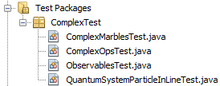

# Quantum Computing

This project is built following the guide presented in the book [Quantum Computing for Computer Scientists](https://www.amazon.com/Quantum-Computing-Computer-Scientists-Yanofsky/dp/0521879965), the software is thouhgt as a library and you will find the necessary tools to simulate basic systems in the Quantum world (also you have some systems already simulated), the objective was to developed certain tools and we do not provide a UI or menu to use the tools, you have to follow classes specifications to be able to understand and use the software in this project.

## Getting Started

These instructions will get you a copy of the project up and running on your local machine for development and testing purposes.

### Prerequisites

At the last version of the project you do not need any specific programas to be installed in your machine different to Java 8. My JDK specifications are:

```
java version "1.8.0_73"
Java(TM) SE Runtime Environment (build 1.8.0_73-b02)
Java HotSpot(TM) 64-Bit Server VM (build 25.73-b02, mixed mode)
```

We used the IDE [NetBeans](https://netbeans.org/) but you can use any IDE of your preference. The specifications are:
```
Product Version: NetBeans IDE 8.2 (Build 201609300101)
```

## Running the tests

You will have a structure of test file that looks like this:



### Break down into end to end tests

Explain what these tests test and why

```
Give an example
```

### And coding style tests

Explain what these tests test and why

```
Give an example
```

## Authors

* **Fabián Ardila** - *Development* - [LinkedIn](https://www.linkedin.com/in/fabi%C3%A1n-ardila-3a9622101/)
* **Daniel Benavides** - *Mentoring* - [Info.](https://scienti.colciencias.gov.co/cvlac/visualizador/generarCurriculoCv.do?cod_rh=0001016199)

## License

This project is licensed under the MIT License - see the [LICENSE.md](LICENSE.md) file for details
